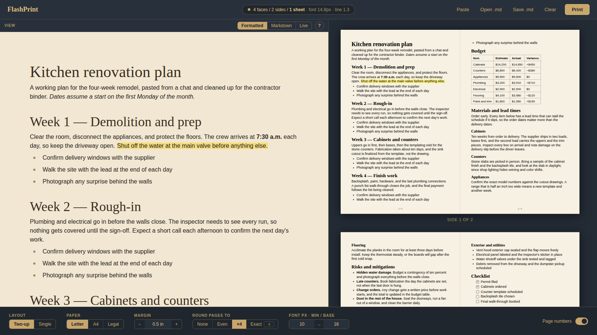
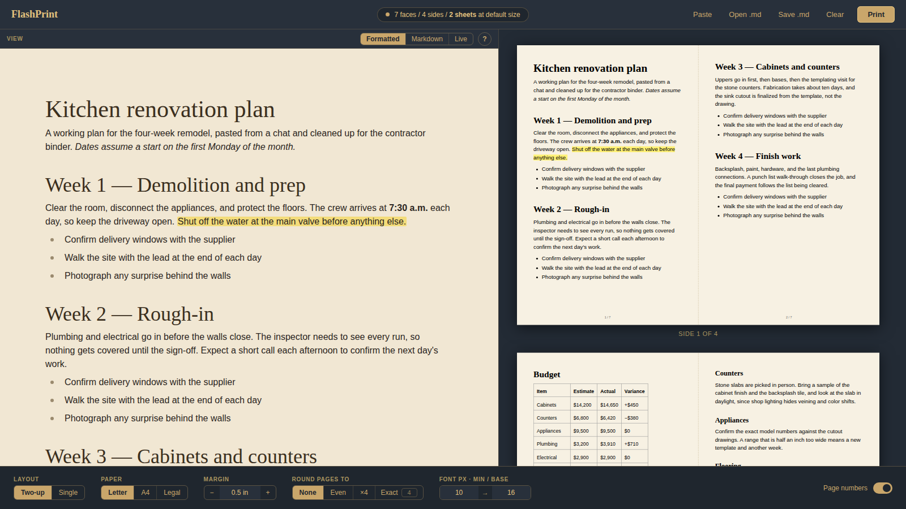
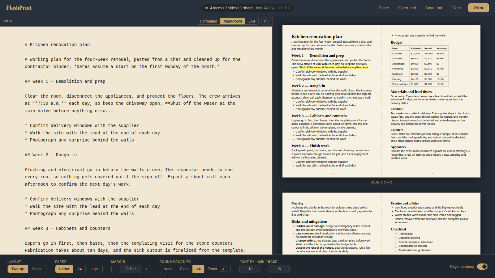
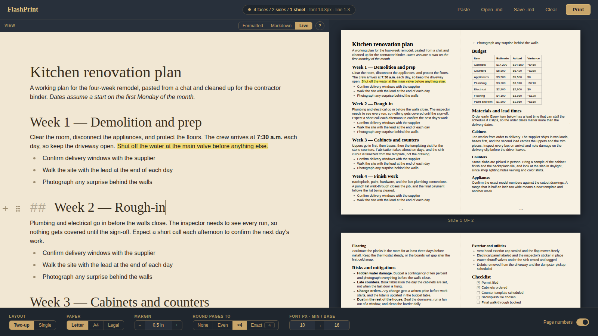
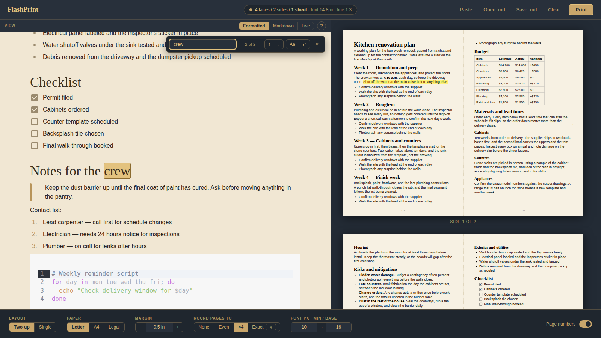
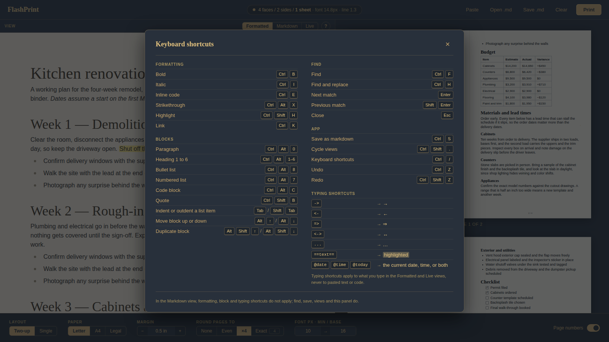
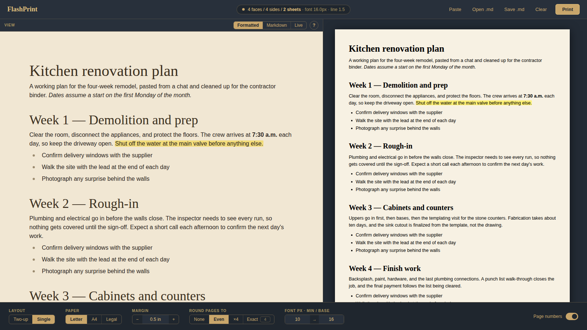

# FlashPrint

Paste markdown, edit it, and print it two pages to a sheet. FlashPrint changes the font size and spacing so the document fits the page count you pick, and it packs the pages onto landscape sheets so you use half the paper.

**Live app:** [markburbridge.com/FlashPrint](https://markburbridge.com/FlashPrint)



> **About this repository.** FlashPrint is a one-contributor fork of [Milkdown](https://github.com/Milkdown/milkdown). It lives in the [`flashprint/`](flashprint) folder and uses Milkdown's Crepe editor. The rest of the repository is Milkdown, made by many people. See [Credits](#credits).

## What it does

You paste markdown from a chat, a note, or a file. FlashPrint shows it in an editor on the left and as printed pages on the right. You choose how many pages the result should have, and it shrinks the text just enough to get there.

- **Two-up printing.** Two half-size pages sit side by side on a landscape sheet. Turn it off for one portrait page per sheet.
- **Fit to a page count.** Round to an even count, a multiple of four (two pages per sheet, printed on both sides), or an exact number.
- **Small margins.** The default is 0.5 inch. Set any margin you like.
- **Live preview.** The preview and the printed output share one layout, so the page count on screen is the page count on paper.
- **Full editing.** Change anything in the text. The preview refits as you type.

## How the fit works

The status pill at the top counts three things.

| Word   | Meaning                                                             |
| ------ | ------------------------------------------------------------------- |
| Faces  | Pages of content                                                    |
| Sides  | Printed sides of paper. Two faces share a side in the two-up layout |
| Sheets | Physical paper, counting both sides                                 |

FlashPrint first counts the faces at the default size. It then shrinks paragraph and heading spacing before it touches the font, because tight spacing reads better than a small typeface. A binary search over 48 steps finds the mildest setting that reaches the target. You set the smallest font it may use and the font it starts from.

Here is one document before and after. At the default size it takes 7 faces on 2 sheets. Rounded to a multiple of four, it fits 4 faces on 1 sheet at a 14.8px font.

| Rounding off                                                             | Rounded to a multiple of four                                      |
| ------------------------------------------------------------------------ | ------------------------------------------------------------------ |
|  |  |

## Editing

The editor has three views. **Formatted** is the default and shows rendered text, like a word processor. The other two are below.

| Markdown                                                        | Live                                                               |
| --------------------------------------------------------------- | ------------------------------------------------------------------ |
|  |             |
| The raw markdown source                                         | Rendered text that shows the syntax of the block your cursor is in |

Press `Ctrl+Shift+.` to cycle through the views.

- **Copy as markdown.** Copying from the editor puts markdown on the clipboard, with no stray escapes.
- **Find and replace.** `Ctrl+F` finds and `Ctrl+H` replaces, with a case toggle.
- **Highlights.** Type `==text==` or press `Ctrl+Shift+H`. Highlights print.
- **Blocks.** Move a block with `Alt+Up` and `Alt+Down`. Duplicate one with `Alt+Shift+Up` or `Alt+Shift+Down`.
- **Typing shortcuts.** `->` becomes an arrow, and `@date`, `@time`, and `@today` insert the current date and time.
- **Wrapped tables.** A table inside a tag such as `<mdtable> ... </mdtable>` stays editable, and the tags are kept when you save.
- **Files.** Paste, drop a file, open a `.md` file, or save with `Ctrl+S`.
- **Autosave.** The document and settings save in your browser.

Press `Ctrl+/` to see every shortcut.

| Find                                                                       | Shortcuts                                                              |
| -------------------------------------------------------------------------- | ---------------------------------------------------------------------- |
|  |  |

## Single-page layout

Switch to **Single** for one portrait page per sheet. The fit works the same way.



## Printing

1. Press **Print**.
2. In the print dialog, choose **Landscape** for two-up, or **Portrait** for single.
3. Set margins to **None** and scale to **100%**.
4. Turn off headers and footers.

FlashPrint sets the page size itself, so the browser's paper size does not matter. Letter, A4, and Legal are supported.

## Run it locally

You need Node 22 or newer and [pnpm](https://pnpm.io/).

```sh
pnpm install
pnpm --filter=@milkdown/flashprint start
```

The dev server opens at `http://localhost:5173/FlashPrint/`.

Run the tests.

```sh
pnpm exec vitest run --project flashprint
cd flashprint && pnpm test
```

The first command runs the unit tests. The second runs the browser tests in Chromium with Playwright.

Deployment notes for Vercel and GitHub Pages, and a deeper look at the fitting code, are in [`flashprint/README.md`](flashprint/README.md).

## Credits

FlashPrint stands on Milkdown. The editor, the markdown parser and serializer, the table, code block, and list features, and the plugin system all come from that project and the people who built it.

- **[Saul Mirone](https://github.com/Saul-Mirone)** created Milkdown and has maintained it for years.
- **[Meo](https://meo.cool/)** designed the Milkdown website and its look.
- **Every contributor** who has committed to Milkdown. Dozens of people have code in this repository's history, and the graph below lists them.

<a href="https://github.com/Milkdown/milkdown/graphs/contributors">
  
</a>

Milkdown is built on [ProseMirror](https://prosemirror.net/) and [remark](https://github.com/remarkjs/remark), and is inspired by [Typora](https://typora.io/). FlashPrint also uses [CodeMirror](https://codemirror.net/) for code blocks and [KaTeX](https://katex.org/) for math.

The sponsors and supporters who back Milkdown are listed in the [upstream README](https://github.com/Milkdown/milkdown#readme). If FlashPrint is useful to you, please support them.

### About this fork

This fork has one human contributor, [@mtburbridge-creator](https://github.com/mtburbridge-creator), who wrote FlashPrint with [Claude Code](https://claude.com/claude-code). The `flashprint/` folder holds the app. Apart from a few fork files, such as the design notes in `new layout/` and the Pages workflow, the rest of the repository is Milkdown as it was.

## About Milkdown

Milkdown is a plugin-driven WYSIWYG markdown editor. Its [documentation](https://milkdown.dev/) covers the editor, the plugin API, and the Crepe editor that FlashPrint uses. To contribute to Milkdown itself, follow the [upstream contribution guide](https://github.com/Milkdown/milkdown/blob/main/CONTRIBUTING.md) and send changes to the [Milkdown repository](https://github.com/Milkdown/milkdown).

<div align="center">
  
</div>

## License

[MIT](/LICENSE). Copyright (c) 2020-present Mirone.
